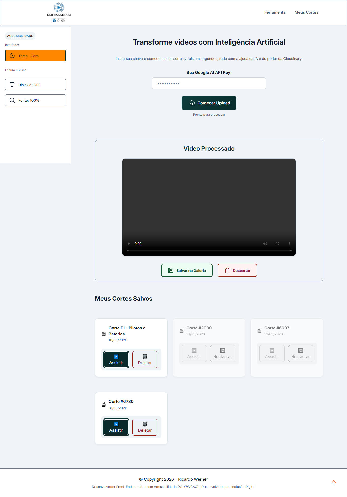
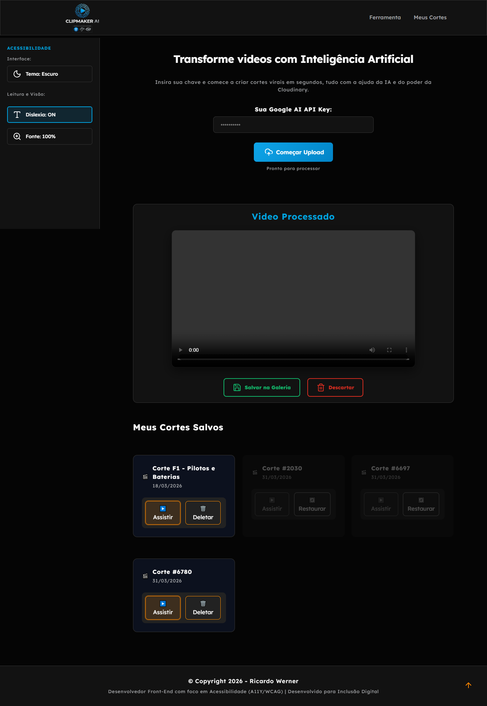
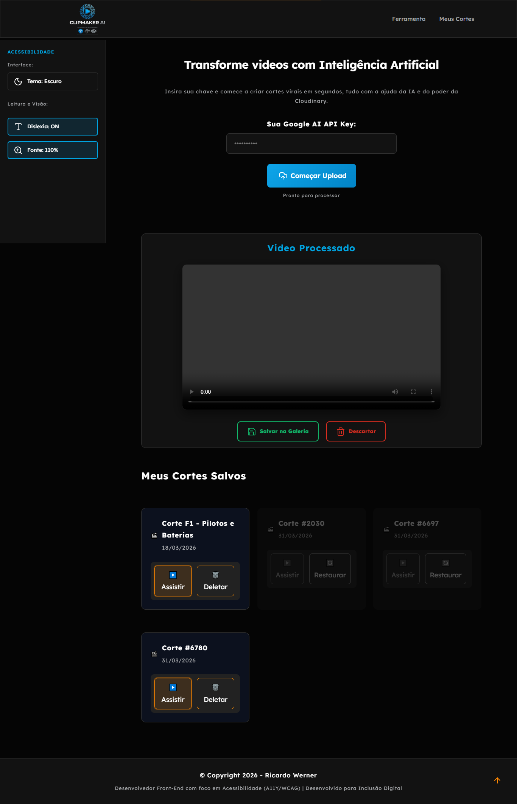
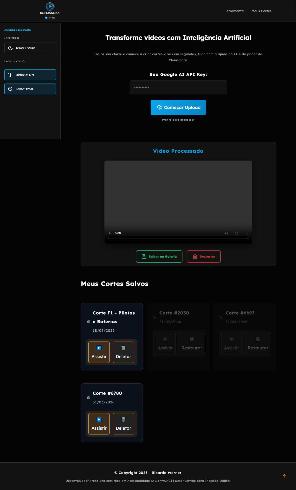

# ClipMaker AI — Rocketseat NLW-22 (Operator)

Aplicação web para gerar, visualizar e gerenciar cortes de vídeo com apoio de IA, com foco em **acessibilidade (A11Y/WCAG 2.2)**, UX de teclado e persistência híbrida de galeria.

---

## 🚀 Visão geral

O projeto foi desenvolvido na trilha iniciante da **NLW-22 (2026)** com evolução contínua de arquitetura, estilo e acessibilidade.

### Objetivo

Transformar o fluxo de cortes em uma experiência simples e inclusiva:

1. Upload e processamento de mídia
2. Apoio de IA para identificar trechos de destaque
3. Preview com ações de salvar/descartar
4. Galeria persistida com controle de estado e navegação acessível

---

## ✨ Principais funcionalidades

- **Tema claro/escuro com persistência** (`localStorage`)
- **Modo dislexia** com feedback textual e ARIA
- **Escala de fonte** em ciclo (`100% → 110% → 125%`)
- **Navegação por teclado nos cards** (roving tabindex + setas + Enter/Espaço)
- **Status acessível** com `role="status"`, `aria-live="polite"` e `aria-atomic="true"`
- **Fallback resiliente do logo por tema** (principal `.png` + fallback `.svg`)
- **Controle de estado da galeria** (ativos/desativados, bloqueio de ações inválidas)

---

## 🏗️ Arquitetura (atual)

### Estrutura de pastas

- `index.html` — estrutura principal da aplicação
- `src/scripts/main.js` — fluxo principal de processamento
- `src/scripts/galeria.js` — regras de galeria e teclado
- `src/scripts/scripts.js` — camada de acessibilidade e interações globais
- `src/styles/` — estilos segmentados por contexto (header, aside, main, galeria, etc.)

### Decisões técnicas relevantes

- **Inicialização orquestrada** via `initializeApp()` no `DOMContentLoaded`
- **Cache de DOM com proteção** (`?.`) para evitar quebra por elemento ausente
- **Tokens de tema** para manter consistência visual e contraste entre claro/escuro
- **Persistência híbrida**: base estática (`galeria.json`) + estado dinâmico (`localStorage`)

---

## ♿ Acessibilidade (A11Y / WCAG 2.2)

Implementações-chave já aplicadas:

- `aria-pressed` e `aria-label` dinâmicos em toggles
- foco visível reforçado no tema claro (`:focus-visible` com anel duplo)
- navegação de teclado previsível em cards e ações internas
- feedback assistivo em mensagens dinâmicas de status
- contraste calibrado no `light-theme` com meta **AA obrigatório** e **AAA onde viável**

> Para histórico completo de refinamentos, consulte `CHANGELOG.md`.

---

## 🖼️ Prévia da interface

<p align="center">
  
  
</p>

<p align="center">
  
  
  
</p>

<p align="center">
  
</p>

---

## 🧪 Como executar localmente

1. Clone o repositório.
2. Abra a pasta no VS Code.
3. Execute com Live Server (recomendado) **ou** abra `index.html` no navegador.

### Opcional (via terminal)

```bash
git clone https://github.com/ricardo-werner/ClipMaker_AI.git
cd ClipMaker_AI
```

---

## 🛠️ Stack

- **HTML5** semântico
- **CSS3** modular com tokens e responsividade
- **JavaScript (Vanilla)** para estado, eventos e manipulação de DOM
- **Lucide Icons**
- **Cloudinary** (fluxo de mídia)
- **Gemini 2.5 Flash** (apoio de IA)

---

## 📌 Entrega mais recente

### 2026-03-30 — Hardening de inicialização + fallback de logo

- Orquestração de boot com `initializeApp()`
- Correção de ordem de inicialização no `DOMContentLoaded`
- Proteção de leitura de DOM para `themeIcon`
- Fallback robusto do logo por tema com auto-desarme do `onerror`

Assets do logo:

- claro: `./src/images/Clipmaker_logo_light.png`
- escuro: `./src/images/Clipmaker_logo_night.png`
- fallback claro: `./src/images/Clipmaker_logo_light.svg`
- fallback escuro: `./src/images/Clipmaker_logo_night.svg`

---

## 🗺️ Roadmap

- [ ] Modularizar totalmente a camada de acessibilidade (`a11y.js`)
- [ ] Consolidar métricas de contraste em checklist automatizado
- [ ] Expandir cobertura de testes de teclado por breakpoint
- [ ] Refinar documentação de onboarding para contribuição

---

## 👨‍💻 Autor

**Ricardo Werner**  
Desenvolvedor Front-end com foco em A11Y, WCAG e inclusão digital.
